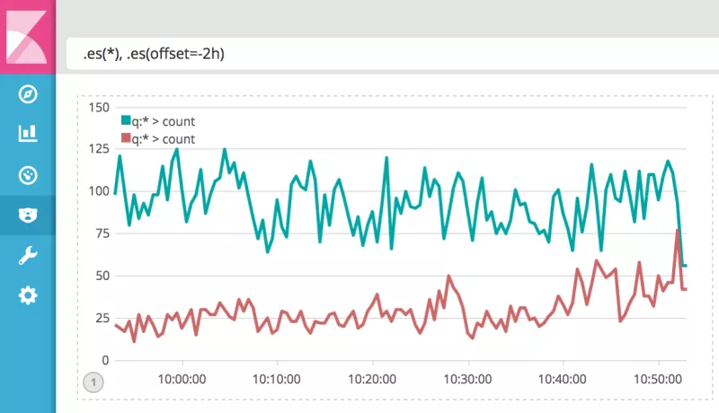

# Timelion
* The time series composer for Kibana

## Usage
* 이전 데이터와 비교
```
.es(*), .es(offset=-1d)
```


```
.es(*).divide(.es(offset=-2h))
```

## ref
* https://www.elastic.co/kr/blog/timelion-timeline
