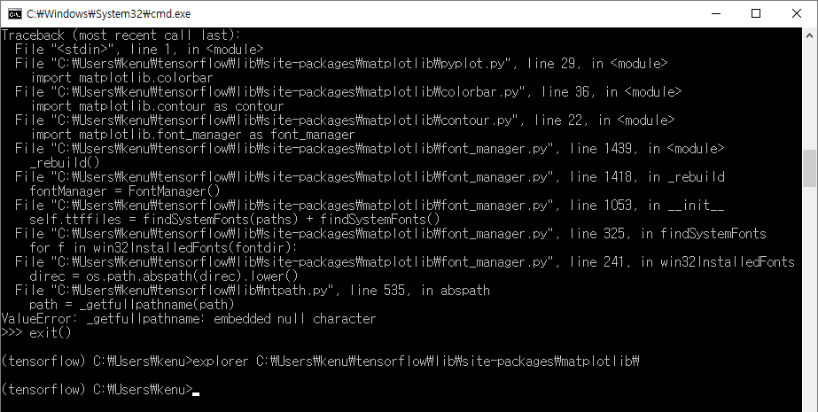
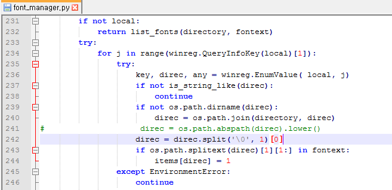

# matplotlib for windows
* `pip install matplotlib`
* `import matplotlib.pyplot as plt`

### error
* `ValueError: _getfullpathname: embedded null character`  

### fix
* open file font_manager.py  

* comment out and insert code
* `direc = direc.split('\0', 1)[0]`

## ref
  * http://stackoverflow.com/questions/34004063/error-on-import-matplotlib-pyplot-on-anaconda3-for-windows-10-home-64-bit-pc