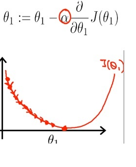
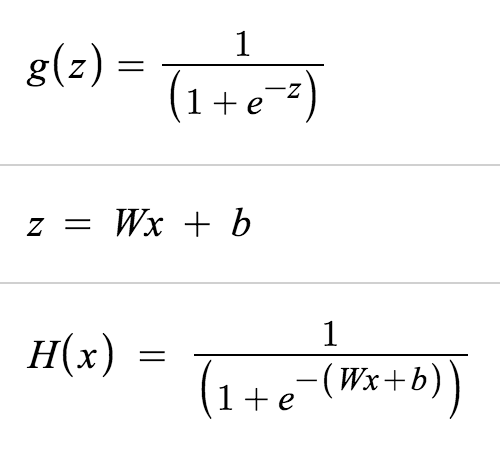
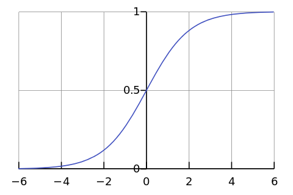

# TensorFlow
* ML Library
* https://www.tensorflow.org/

## install
* https://www.tensorflow.org/get_started/os_setup
* mac
  * virtualenv 사용
```
sudo pip install --upgrade virtualenv
virtualenv --system-site-packages ~/tensorflow
source ~/tensorflow/bin/activate
TF_BINARY_URL=https://storage.googleapis.com/tensorflow/mac/cpu/tensorflow-0.12.0-py2-none-any.whl
pip install --upgrade $TF_BINARY_URL
deactivate
```

  * win
```
pip install --upgrade virtualenv
virtualenv --system-site-packages tensorflow
tensorflow\Scripts\activate
pip install --upgrade https://storage.googleapis.com/tensorflow/windows/cpu/tensorflow-0.12.1-cp35-cp35m-win_amd64.whl
deactivate
```
  * https://www.microsoft.com/ko-KR/download/details.aspx?id=53587
  * Microsoft Visual C++ 2015 재배포 가능 패키지(x86) 14.0.23504 필요
  * [matplotlib install for windows](//okdevtv.com/mib/tensorflow/matplotlib)

## first example
```
import tensorflow as tf
import numpy as np

# Create 100 phony x, y data points in NumPy, y = x * 0.1 + 0.3
x_data = np.random.rand(100).astype(np.float32)
y_data = x_data * 0.1 + 0.3

# Try to find values for W and b that compute y_data = W * x_data + b
# (We know that W should be 0.1 and b 0.3, but TensorFlow will
# figure that out for us.)
W = tf.Variable(tf.random_uniform([1], -1.0, 1.0))
b = tf.Variable(tf.zeros([1]))
y = W * x_data + b

# Minimize the mean squared errors.
loss = tf.reduce_mean(tf.square(y - y_data))
optimizer = tf.train.GradientDescentOptimizer(0.5)
train = optimizer.minimize(loss)

# Before starting, initialize the variables.  We will 'run' this first.
init = tf.global_variables_initializer()

# Launch the graph.
sess = tf.Session()
sess.run(init)

# Fit the line.
for step in range(201):
    sess.run(train)
    if step % 20 == 0:
        print(step, sess.run(W), sess.run(b))

# Learns best fit is W: [0.1], b: [0.3]
```
* code from : https://www.tensorflow.org/get_started/

## Linear Regression


### Gradient Descent Method
* 경사하강법
* `tf.train.GradientDescentOptimizer()`
* 
* 

## Logistic Regression
* 
* 
* 0 or 1
* True of False

### Sigmoid
* https://www.desmos.com/calculator/vvl1zn7wfn

## NCE loss
* noise-contrastive estimation loss
* 텐서플로우(TensorFlow)를 이용해 자연어를 처리하기(NLP) – Word Embedding(Word2vec)
  * http://solarisailab.com/archives/374

### Rectifier Linear Unit
* ReLU

## CNN
* Convolutional Neural Network
* 이미지를 작게 쪼개어서 분석하는 기법

## RNN
* Recurrent Neural Networks
* 레이어간 영향을 주는 NN

### LSTM
* Long Short Term Memory

### GRU

## GAN

## TensorFlow Term
* rank : dimension of tensor
* shape : rows and columns of tensor
* type : data type of tensor

```
import numpy as np
tensor_1d = np.array([1.3, 1, 4.0, 23.99])

print tensor_1d

print tensor_1d[0]

tensor_1d.ndim

tensor_1d.shape

tensor_1d.type

import tensorflow as tf
tf_tensor = tf.convert_to_tensor(tensor_1d, dtype=tf.float64)
```

```
tensor_2d = np.array([(1,2,3,4), (5,6,7,8), (9,10,11,12), (13,14,15,16)])
print tensor_2d

tensor_2d[0:2,0:2]
```

### Random functions
* random_uniform() : Uniform Distribution Funtion
  * random_uniform(shape, minval, maxval, dtype, seed, name)
  * Uniform Distribution : 주어진 범위 내의 모든 수가 동일한 분포를 갖는 형태
* random_normal() : Normal Distribution Function
  * random_normal(shape, mean, stddev, name)

## term
* Max: what's the maximum of a function?
* Argmax: what's the input that gives us that maximum?
  * from : http://www.aiqus.com/forum/questions/26495/what-is-the-difference-between-argmax-and-max

## tasks
* 선형 회귀
  * 합격 여부 예측
* RNN
  * Chatbot
* CNN
  * 비슷한 이미지 찾기


## 서적
* 텐서플로 첫걸음
  * http://www.aladin.co.kr/shop/wproduct.aspx?ItemId=89824250
* 텐서플로 입문
  * http://www.aladin.co.kr/shop/wproduct.aspx?ItemId=94238233
* 어서와! 머신러닝은 처음이지? (R)
  * http://www.aladin.co.kr/shop/wproduct.aspx?ItemId=99084501

## tensorboard
* TensorFlow 시각화 기능

### code
* `name="a"`
* `merged = tf.merge_all_summaries()`
* `writer = tf.train.SummaryWriter("/tmp/tensorflowlog", session.graph)`

### tensorboard 실행
```
tensorboard --logdir=/temp/tensorflowlogs
```
* http://localhost:6006/

## ref
* 모두를 위한 머신러닝/딥러닝 강의
  * http://hunkim.github.io/ml/
  * https://github.com/aymericdamien/TensorFlow-Examples
* 시즌2 모두를 위한 딥러닝 - Deep Reinforcement Learning
  * https://www.inflearn.com/course/reinforcement-learning/
* TensorFlow Tutorials by 골빈해커
  * https://github.com/golbin/TensorFlow-Tutorials
* 솔라리스의 인공지능 연구실
  * http://solarisailab.com/
* 내가 찾은 Deep Learning 공부 최단경로(?)
  * http://blog.naver.com/chesterroh/220920668374
* https://github.com/TensorFlowKR/awesome_tensorflow_implementations
* Char RNN : https://github.com/sherjilozair/char-rnn-tensorflow
* Word RNN : https://github.com/hunkim/word-rnn-tensorflow
